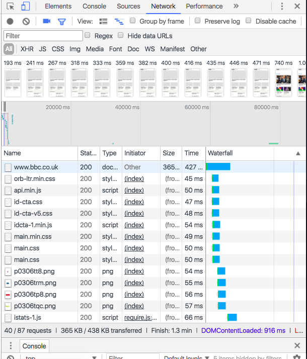

# Web Testing and Selenium

### Intro to Web testing

* Need to start gauging possible user journeys when first looking at a website
* Begin with what the website does, sensible user journies etc.
* Finding ids in html - invaluable - direct target, often static
* Access objects by css selectors as well
* Classes are to be reused again and again
* Text is another tag that's useful
* Ids more useful than classes
* Loads of classes, not object oriented, really hard to automate testing
* Emulate 
* What should load first?
* Recorded - shows what has been loaded at different time intervals
* JavaScript and jQuery loads after images - **get content onto the site**



* Look out for annoying things - things that frustrate you as a user
* Find out where site is most used, and concentrate testing there - except if it involves money
* Sources indicates where files come from
* Can record in performance, get graphs and also shows when files are loaded
* Can get so much data from the dev tools
* Can look at security
* Run audits on a page - check desktop and mobile sites - can download report
* Audit generated for instance at the time

### Selenium 

* Server and service (**not supported for IE7**)
* Can be scripted with a multitude of languages, such as JavaScript and Ruby
* Web driver
* Selenium can talk to browser drivers, such as Chrome Driver or Marionette (FireFox)
* IE doesn't have a driver - direct
* Write code, necessary bindings to talk to Selenium, which allows it to communicate with the browser driver, which then drives the browser
* Selenium is the base (base bindings) - can add tools on top
* One of the most used is Capybara
* Cucumber - behavioural driven development
* Exploratory testing - documenting what you're testing - charts etc.
* Integration testing - ensuring that data is being handled correctly
* GUI testing - selenium etc.
* Accessibility, what user interacts with etc.
* Domain specific language - capybara and cucumber have their own languages, both inherit from selenium, build upon it
* Driver class within selenium module
* Need to tell selenium what browser driver to use
* ```Selenium::WebDriver::Chrome.driver_path```
* Use ```which chromedriver``` to find path
* toolsqa - demo sites to practice with
* Automatic closedown of driver once it has finished
* Tell it to sleep for a number of seconds to see page properly and stop it closing instantly
* Node based parsing of the tags
* xpath - literal path - not dynamic
* @driver is binding block for chromedriver
* click method useful
* displayed? method also useful - when outputted to the console, will indicate true or false
* Checking that the right html tags are in the right place - not to do with styling
* Care about user journies of logging in, making payments etc.
* send_keys - send keystrokes - puts name etc into the input
* Integration testing concerned with data and data flow
* ```puts @driver.find_element(:name, 'firstname')['value']```
* Can also add an '==' and then something to match - **don't do this or test in this file - make an rspec file**
* current_url is a useful method
* Can test with css
* Copy with xpath is an option in the chrome devtools
* For xpaths - '//' means that the xpath is beginning, * indicates all - everything
* '//*' - in the entire page, look for the id, url, then strong[1]
* **Capybara inherits fom selenium** - has own domain specific language on top of selenium - makes it faster and easier to use
* Capybara is a module - most gems start off as modules
* Registered chrome browser, looks for chrome driver
* Capybara searches for multiple things
* manual page object model - overarching class - create pages within it, objects themselves - contain methods
* lib - functional areas of the code
* Put overriding file for entire site in lib
* Pages are individual objects
* Set up constants in the page objects
* SIGN_IN_LINK_ID indicates its an id - look for id on page
* get to rspec - only object that needs to be instantiated is the main one, as the main class instantiates the objects for you
* **Database is very important**
* Can build framework to get data for tests - helpers get data, provide data needed to run test
* Data independent - if database is the same, can use it anywhere - very resuable, independent framework